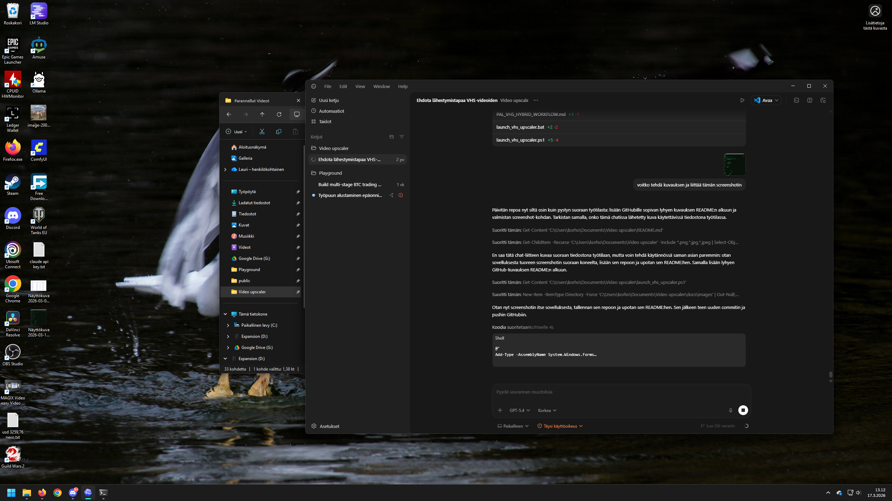

# VHS Upscaler

A local Windows GUI for restoring and upscaling VHS captures with free tools.

The app wraps a practical restoration pipeline around VapourSynth, QTGMC, FFmpeg, and Real-ESRGAN NCNN Vulkan. It is designed for home-video workflows where the goal is a cleaner, easier-to-watch result rather than fake "true HD" detail.

Desktop GUI for restoring PAL and NTSC VHS captures with QTGMC, FFmpeg, and Real-ESRGAN.



Latest release download:
- [VHSUpscaler-0.1.0-windows-x64.zip](https://github.com/Lataa1/vhs-video-upscaler/releases/download/v0.1.0/VHSUpscaler-0.1.0-windows-x64.zip)

## Features

- Desktop GUI for the full VHS pipeline
- `PAL` and `NTSC` workflow presets
- QTGMC-based deinterlacing and light cleanup
- Optional AI upscale with multiple model choices
- Single-frame preview rendering for quick model comparison
- Estimated final output resolution shown in the UI
- Auto-detection for local tool paths
- Optional cleanup of intermediate files after success
- Stop button and safe shutdown when the window is closed during a job

## Pipeline

1. Generate a VapourSynth restore script.
2. Render a lossless FFV1 restored master.
3. Split long videos into segments.
4. Run Real-ESRGAN on each segment.
5. Encode and combine the final output.

## Current output geometry

The app exports square-pixel 4:3 output by default.

Typical results:
- `PAL`, deinterlace only: `768x576`
- `PAL`, AI scale `2x`: `1536x1152`
- `NTSC`, deinterlace only: `640x480`
- `NTSC`, AI scale `2x`: `1280x960`

## Repository contents

Main application files:
- [vhs_upscaler_gui.py](./vhs_upscaler_gui.py)
- [launch_vhs_upscaler.bat](./launch_vhs_upscaler.bat)
- [launch_vhs_upscaler.ps1](./launch_vhs_upscaler.ps1)
- [build_exe.ps1](./build_exe.ps1)
- [VHS_UPSCALER_APP_README.md](./VHS_UPSCALER_APP_README.md)

Additional workflow reference:
- [PAL_VHS_HYBRID_WORKFLOW.md](./PAL_VHS_HYBRID_WORKFLOW.md)
- [pal_vhs_qtgmc_restore.vpy](./pal_vhs_qtgmc_restore.vpy)

## Requirements

The repository does not bundle third-party binaries in source control.

You need:
- `ffmpeg.exe`
- `ffprobe.exe`
- `VSPipe.exe`
- VapourSynth plugins required by the generated script
- `realesrgan-ncnn-vulkan.exe`

The app can auto-detect local tool folders if you keep them under a `tools/` folder next to the project, but `tools/` is intentionally ignored in git.

## Getting the tools

The easiest Windows setup is:

1. Download a ready-to-use FFmpeg Windows build and place it under `tools/FFmpeg/`.
2. Install VapourSynth Portable for Windows and make sure `VSPipe.exe` is available.
3. Install the required VapourSynth plugins, either with `vsrepo` or by using a prepared portable setup.
4. Download `realesrgan-ncnn-vulkan` for Windows and place it under `tools/RealESRGAN/`.
5. Start the app and use `Auto-Detect Tools` on the `Tools` tab.

Recommended official starting points:
- FFmpeg downloads page: [ffmpeg.org/download.html](https://www.ffmpeg.org/download.html)
- VapourSynth installation guide: [vapoursynth.com/doc/installation.html](https://www.vapoursynth.com/doc/installation.html)
- Real-ESRGAN NCNN Vulkan releases: [xinntao/Real-ESRGAN-ncnn-vulkan releases](https://github.com/xinntao/Real-ESRGAN-ncnn-vulkan/releases)

Note:
- FFmpeg itself links to third-party Windows builds rather than shipping official Windows binaries directly.
- VapourSynth's Windows installation guidance currently points to the portable install script as the easiest route.

## Launching the app

Recommended:
- [launch_vhs_upscaler.bat](./launch_vhs_upscaler.bat)

Alternative:
- [launch_vhs_upscaler.ps1](./launch_vhs_upscaler.ps1)
- [Latest release zip](https://github.com/Lataa1/vhs-video-upscaler/releases/download/v0.1.0/VHSUpscaler-0.1.0-windows-x64.zip)

The PowerShell launcher correctly handles project paths that contain spaces.

You can also run the GUI directly:

```powershell
py -3.12 .\vhs_upscaler_gui.py
```

## If Windows blocks the app

If you download the release `.zip` from GitHub, Windows may mark it as coming from the internet and block the extracted files.

Try this first:

1. Right-click the downloaded `.zip`
2. Open `Properties`
3. Check `Unblock`
4. Click `Apply`
5. Extract the zip after that

If you already extracted it, you can remove the block in PowerShell:

```powershell
Get-ChildItem "C:\path\to\extracted-folder" -Recurse -File | Unblock-File
```

This can be necessary even when starting the app through `.bat` or `.ps1`, because Windows may still block the launched binaries.

## Building the `.exe`

Use:

```powershell
.\build_exe.ps1
```

Note: unsigned `.exe` builds may be blocked by Windows Smart App Control.

## Recommended defaults

For PAL VHS:
- `Video standard`: `PAL`
- `Field order`: `TFF`
- `QTGMC preset`: `Very Slow`
- `Crop`: `4 / 4 / 0 / 8`
- `Segment minutes`: `30`
- `Model`: `realesr-animevideov3`
- `Scale`: `2`
- `Final codec`: `libx264`
- `Final CRF`: `12`

For NTSC VHS:
- `Video standard`: `NTSC`
- `Field order`: start with `TFF`, test `BFF` if motion looks wrong
- `QTGMC preset`: `Very Slow`
- `Scale`: `2`
- `Final codec`: `libx264`
- `Final CRF`: `12`

## AI model notes

Safe default:
- `realesr-animevideov3`

Available test models:
- `remacri-4x`
- `ultramix-balanced-4x`
- `ultrasharp-4x`
- `upscayl-standard-4x`

Some models may look sharper but also more artificial. VHS material benefits from conservative settings.

## Known limitations

- VHS source quality is still the main limiting factor.
- Long tapes can take many hours, especially in the AI stage.
- Intermediate processing can use a large amount of disk space.
- VapourSynth plugin problems will block the restore stage.
- The unsigned `.exe` may be blocked on some Windows systems.

## License

This project is released under the [MIT License](./LICENSE).
